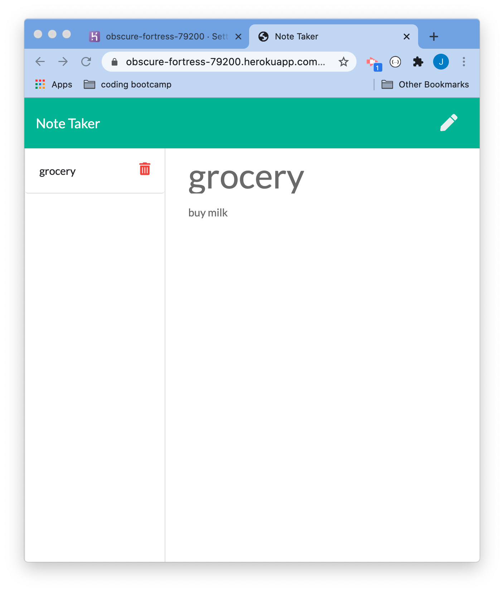

# Note-Taker

## Description 

This repository consists of code for a note taker app. The application allows the user to save and delete notes. 

This app is a full stack project. HTML,CSS and javascripts were used to design the front end. Node was used for backend.Node's express was used for routing to perform various api calls like retrieve(GET), save(POST), and delete (DELETE). Node's file system was used to read and write data into JSON file. The application was deployed and tested in heroku.

Git is used for version controlling and for periodic commits to Gitlab.

## Installation

Execute ``` npm install ``` command in terminal(Mac) or command promt(windows) to install all needed packages to run this application successfully.

Run ``` npm run start ``` command in terminal(Mac) or command promt(windows) to start the application.


## Screenshots
<br>